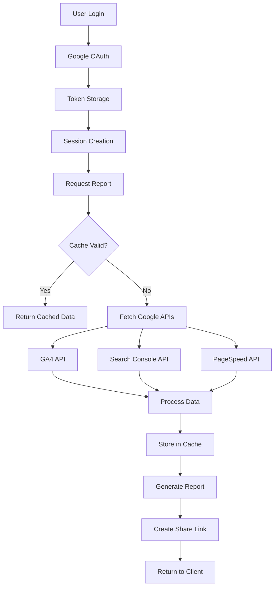

# Backend Architecture Analysis - Next.js 14 SEO Reporting Platform

## Executive Summary
This is a comprehensive Next.js 14 SEO reporting platform that integrates with Google services (Analytics, Search Console, PageSpeed Insights) and provides advanced SEO monitoring, reporting, and AI-powered visibility tracking. The platform uses a PostgreSQL database via Supabase, Prisma ORM, and implements sophisticated authentication, caching, and data management strategies.

## 1. API Route Architecture

### Directory Structure
The application follows Next.js 14 App Router conventions with a well-organized API structure:

```
/app/api/
├── accounts/           # Google account management
├── admin/             # Admin-specific endpoints
├── ai-visibility/     # AI platform visibility tracking
├── analytics/         # Google Analytics integration
├── auth/              # Authentication endpoints
│   ├── [...nextauth]/ # NextAuth.js dynamic routes
│   ├── callback/      # OAuth callbacks
│   ├── google/        # Google-specific auth
│   └── logout/        # Session termination
├── cron/              # Scheduled tasks
├── data/              # Data fetching endpoints
├── google/            # Google API integrations
├── google-accounts/   # Google account connections
├── reports/           # Report generation & management
├── search-console/    # Search Console integration
├── seo/               # SEO analysis endpoints
└── test/              # Testing endpoints
```

### Key Characteristics
- **RESTful Design**: Clear resource-based routing
- **Modular Structure**: Separated by functionality domain
- **Dynamic Routes**: Uses Next.js dynamic segments for parameterized endpoints
- **Public/Private Split**: Separate public API endpoints for shared reports

## 2. Authentication & OAuth Implementation

### NextAuth.js Configuration
The platform uses NextAuth.js with two authentication strategies:

#### Production Strategy (`auth-options.ts`)
```typescript
- Session Strategy: Database-based sessions
- Adapter: PrismaAdapter for persistent sessions
- Provider: Google OAuth with extended scopes
- Scopes:
  - Basic: openid, email, profile
  - Analytics: analytics.readonly
  - Search Console: webmasters.readonly
```

#### Development/Debug Strategy (`auth-options-simple.ts`)
```typescript
- Session Strategy: JWT-based (stateless)
- No Adapter: Faster development iteration
- Same Google OAuth configuration
- Simplified token handling
```

### Token Management Architecture
The `GoogleTokenManager` class provides centralized token management:

```typescript
class GoogleTokenManager {
  // Token retrieval priority:
  1. Account-specific tokens (GoogleAccount table)
  2. Cookie-based tokens (for immediate auth)
  3. User's stored tokens (GoogleTokens table)
  
  // Features:
  - Automatic token refresh on expiry
  - Multiple fallback mechanisms
  - Secure token storage in database
  - OAuth2Client configuration
}
```

### Authentication Flow
1. **Initial Login**: User authenticates via Google OAuth
2. **Token Storage**: Tokens saved in multiple locations for redundancy
3. **Session Creation**: Database or JWT session established
4. **Token Refresh**: Automatic refresh before expiry
5. **API Access**: Valid tokens used for Google API calls

## 3. Database Architecture (Prisma/PostgreSQL)

### Core Models

#### User Management
```prisma
- User: Core user entity
- Account: OAuth provider accounts
- Session: Active user sessions
- GoogleTokens: Google-specific token storage
- GoogleAccount: Google account connections
```

#### Reporting System
```prisma
- Report: Base report entity
- ClientReport: Client-specific branded reports
- ReportAccessLog: Access tracking
- ReportCache: Cached report data
```

#### SEO & Performance
```prisma
- SEOAudit: Comprehensive SEO audits
- CoreWebVitalsMetric: LCP, FID, CLS, etc.
- PageSpeedAudit: PageSpeed Insights data
- ContentQuality: Content analysis
- PageAudit: Raw audit data storage
```

#### Keyword Tracking
```prisma
- Keyword: Keyword definitions
- KeywordPerformance: Weekly performance snapshots
- KeywordVariation: Related keywords
- CompetitorKeywordRank: Competitor tracking
- KeywordAlert: Alert configurations
- KeywordGroup: Grouped keyword tracking
```

#### AI Visibility
```prisma
- AIVisibilityProfile: Overall AI presence
- AIPlatformMetric: Platform-specific metrics
- AICitation: AI platform citations
- AIQueryInsight: Query performance
- AIRecommendation: Improvement suggestions
```

### Database Design Patterns
- **Soft Deletes**: Cascade deletes for data integrity
- **JSON Fields**: Flexible data storage for complex metrics
- **Indexes**: Strategic indexing on frequently queried fields
- **Unique Constraints**: Prevent duplicate data
- **Timestamps**: Automatic created/updated tracking

## 4. Google API Integration Architecture

### Integrated Services

#### Google Analytics 4
- **Endpoint**: `/api/analytics/`
- **API Used**: Google Analytics Admin API v1alpha
- **Data Fetched**: Properties, accounts, metrics
- **Authentication**: OAuth2 with analytics.readonly scope

#### Google Search Console
- **Endpoint**: `/api/search-console/`
- **API Used**: Webmasters API v3
- **Data Fetched**: Sites, performance data, queries
- **Authentication**: OAuth2 with webmasters.readonly scope

#### PageSpeed Insights
- **Configuration**: Uses API key (not OAuth)
- **Data**: Performance scores, Core Web Vitals, opportunities
- **Caching**: 1-hour cache due to rate limits

### API Integration Pattern
```typescript
// Standard API call pattern:
1. Get valid tokens via GoogleTokenManager
2. Check token expiry and refresh if needed
3. Make API request with Bearer token
4. Handle errors and retry logic
5. Transform and cache response data
6. Return normalized data to client
```

## 5. Caching Strategy

### Cache Configuration
```typescript
cacheConfig = {
  api: {
    analytics: 300,      // 5 minutes
    searchConsole: 300,  // 5 minutes
    pageSpeed: 3600,     // 1 hour
  },
  reports: {
    client: 60,          // 1 minute (live updates)
    internal: 300,       // 5 minutes
  }
}
```

### Caching Layers

#### Database Cache (ReportCache table)
- Stores processed report data
- Expiry-based invalidation
- Per-report, per-data-type caching

#### HTTP Cache Headers
- `Cache-Control` headers for CDN caching
- `stale-while-revalidate` for performance

#### In-Memory Caching
- Token caching in GoogleTokenManager
- Temporary data during processing

### Cache Invalidation
- Time-based expiry
- Manual refresh endpoints
- Event-driven invalidation

## 6. Report Generation & Sharing

### Report Types

#### Standard Reports
- User-specific dashboards
- Customizable metrics
- Date range selection
- Real-time data updates

#### Client Reports
- Branded for specific clients
- Shareable via unique links
- Access logging
- Automated refresh schedules

### Report Generation Flow
```
1. User Configuration
   └── Select metrics, date range, properties
2. Data Fetching
   ├── Check cache validity
   ├── Fetch from Google APIs if needed
   └── Store in ReportCache
3. Data Processing
   ├── Normalize data formats
   ├── Calculate derived metrics
   └── Apply business logic
4. Report Rendering
   ├── Generate visualizations
   ├── Create shareable link
   └── Log access
```

### Sharing Mechanism
- **Unique IDs**: CUID-based shareable IDs
- **Access Control**: Public flag for reports
- **Tracking**: ReportAccessLog for analytics
- **Security**: No authentication required for public reports

## 7. External Service Integrations

### Primary Integrations

#### Supabase
- **Role**: Database hosting and authentication
- **Services**: PostgreSQL, real-time subscriptions
- **Configuration**: Pooled connections with PgBouncer

#### Google Cloud Platform
- **OAuth**: Authentication provider
- **APIs**: Analytics, Search Console, PageSpeed
- **Project**: search-insights-hub-25-aug

#### AI Services
- **Anthropic Claude**: AI-powered insights (API key auth)
- **OpenAI**: Content analysis (API key auth)
- **Perplexity**: Research and recommendations (API key auth)

### Third-Party Services
- **Sentry**: Error tracking and monitoring
- **Vercel**: Deployment and edge functions

## 8. Security Architecture

### Authentication Security
- **OAuth 2.0**: Industry-standard authentication
- **Token Encryption**: Secure storage in database
- **Session Management**: Database-backed sessions
- **HTTPS Only**: Enforced in production

### API Security
- **CORS**: Configured for allowed origins
- **Rate Limiting**: Via Vercel Edge
- **Input Validation**: Schema validation on requests
- **SQL Injection Prevention**: Prisma ORM parameterized queries

### Data Security
- **Encryption at Rest**: Supabase database encryption
- **Encryption in Transit**: TLS for all API calls
- **Token Rotation**: Automatic refresh token rotation
- **Secrets Management**: Environment variables

## 9. Performance Optimizations

### Database Performance
- **Connection Pooling**: PgBouncer for connection management
- **Query Optimization**: Indexed fields for common queries
- **Lazy Loading**: Relations loaded on-demand
- **Batch Operations**: Bulk inserts/updates where possible

### API Performance
- **Caching Strategy**: Multi-layer caching
- **Parallel Fetching**: Concurrent API requests
- **Data Pagination**: Limit response sizes
- **Compression**: Gzip responses

### Frontend Performance
- **Static Generation**: Where possible
- **Incremental Static Regeneration**: For reports
- **Edge Functions**: For geographic distribution
- **Asset Optimization**: Next.js automatic optimization

## 10. Scalability Considerations

### Current Architecture Strengths
- **Stateless API**: Horizontal scaling ready
- **Database Pooling**: Handles connection spikes
- **Caching Layers**: Reduces database load
- **Microservice Ready**: Modular API structure

### Potential Bottlenecks
1. **Google API Rate Limits**: Need request queuing
2. **Database Connections**: May need read replicas
3. **Token Refresh**: Could cause thundering herd
4. **Report Generation**: CPU-intensive for large datasets

### Scaling Recommendations
1. **Implement Redis**: For distributed caching
2. **Add Queue System**: For background jobs (Bull/BullMQ)
3. **Database Replicas**: Read replicas for analytics
4. **CDN Integration**: For static assets and reports
5. **Monitoring**: APM tools for performance tracking

## 11. Data Flow Architecture

### Complete Data Flow: OAuth → Report Generation



## 12. Key Technologies Stack

### Core Framework
- **Next.js 14**: React framework with App Router
- **TypeScript**: Type safety and developer experience
- **React**: UI component library

### Backend Technologies
- **Prisma**: ORM for database management
- **NextAuth.js**: Authentication library
- **PostgreSQL**: Primary database (via Supabase)

### API Integration
- **Google APIs Client**: Official Google SDK
- **OAuth2**: Authentication protocol
- **REST APIs**: External service communication

### Infrastructure
- **Vercel**: Deployment platform
- **Supabase**: Backend as a Service
- **Edge Functions**: Serverless compute

## Conclusion

This SEO reporting platform demonstrates a well-architected backend system with:
- **Robust Authentication**: Multi-layered token management
- **Scalable Database Design**: Comprehensive schema with proper indexing
- **Efficient Caching**: Multi-level caching strategy
- **Modular API Structure**: Clear separation of concerns
- **Security Best Practices**: OAuth2, encryption, validation
- **Performance Optimizations**: Caching, pooling, lazy loading

The architecture is production-ready but has clear paths for scaling improvements including distributed caching (Redis), background job processing (queues), and enhanced monitoring. The modular design allows for easy feature additions and service decoupling as the platform grows.