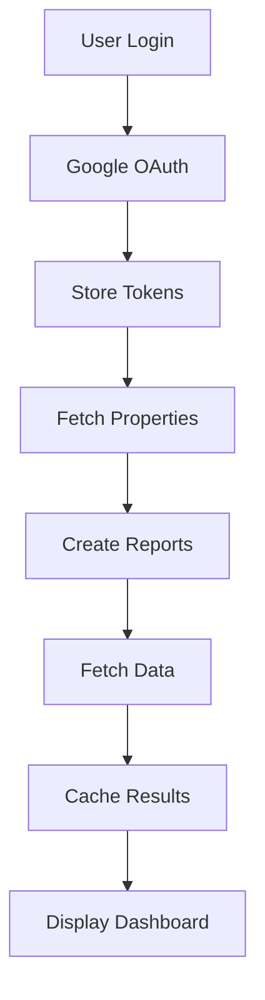

# Search Insights Hub - Complete Project Documentation

## 🎯 Project Overview
Search Insights Hub is a comprehensive SEO reporting platform built with Next.js 14 that integrates with Google Analytics, Search Console, and PageSpeed Insights to provide automated client reporting with advanced SEO analysis capabilities.

## 🏗️ Technology Stack

### Core Framework
- **Next.js 14** - React framework with App Router
- **TypeScript** - Type-safe development
- **React 18** - UI components and state management
- **Tailwind CSS** - Utility-first CSS framework
- **Shadcn/UI** - Modern UI component library

### Database & ORM
- **Prisma ORM** - Database abstraction layer
- **PostgreSQL (Supabase)** - Production database
- **SQLite** - Local development database

### Authentication & Security
- **NextAuth.js** - Authentication framework
- **Google OAuth 2.0** - Primary authentication method
- **HTTP-only cookies** - Secure token storage
- **Session validation** - Server-side session management

### Google API Integrations
- **Google Analytics Data API v1** - Analytics data retrieval
- **Google Search Console API** - Search performance data
- **PageSpeed Insights API** - Performance metrics
- **Chrome UX Report API** - Core Web Vitals data

### Additional Tools
- **Recharts** - Data visualization
- **React Hook Form** - Form management
- **Zod** - Schema validation
- **JSDOM** - Server-side DOM parsing for SEO analysis

## 📁 Project Structure

```
online_client_reporting/
├── app/                          # Next.js App Router
│   ├── admin/                    # Admin dashboard pages
│   │   ├── page.tsx             # Main dashboard
│   │   ├── google-accounts/     # Google account management
│   │   ├── properties/          # GA/GSC properties
│   │   └── reports/             # Report management
│   ├── api/                     # API routes
│   │   ├── admin/               # Admin-only endpoints
│   │   ├── auth/                # Authentication endpoints
│   │   ├── google/              # Google API integration
│   │   ├── reports/             # Report data endpoints
│   │   └── seo/                 # SEO analysis tools
│   └── public/                  # Public report views
├── components/                   # React components
│   ├── ui/                      # Shadcn UI components
│   ├── admin/                   # Admin-specific components
│   └── reports/                 # Report components
├── lib/                         # Utility libraries
│   ├── db/                      # Database utilities
│   ├── google/                  # Google API helpers
│   └── seo/                     # SEO analysis utilities
├── prisma/                      # Database schema
│   ├── schema.prisma            # Development schema
│   └── schema.production.prisma # Production schema
└── types/                       # TypeScript type definitions
```

## 🔐 Authentication Flow

### 1. Google OAuth Flow
```typescript
// Primary authentication path
/api/auth/admin-google/initiate -> Google OAuth -> /api/auth/admin-google/callback
```

### 2. Token Management
- Access tokens stored in HTTP-only cookies
- Refresh tokens stored in database
- Automatic token refresh when expired or expiring within 5 minutes
- Session validation via `/api/auth/check-session`

### 3. Authentication States
- **Active**: Valid access token
- **Expired**: Token needs refresh
- **Re-auth Required**: No refresh token available

## 📊 Data Flow Architecture



## 🗄️ Database Schema

### Core Models

#### User
```prisma
model User {
  id            String    @id @default(cuid())
  email         String?   @unique
  name          String?
  image         String?
  accounts      Account[]
  sessions      Session[]
  reports       Report[]
  clientReports ClientReport[]
}
```

#### Account (Google Account)
```prisma
model Account {
  id                String  @id @default(cuid())
  userId            String
  type              String
  provider          String
  providerAccountId String
  refresh_token     String?
  access_token      String?
  expires_at        Int?
  token_type        String?
  scope             String?
  user              User    @relation(fields: [userId], references: [id])
}
```

#### Report
```prisma
model Report {
  id               String         @id @default(cuid())
  name             String
  domain           String
  ga4PropertyId    String?
  gscPropertyUrl   String?
  userId           String
  isActive         Boolean        @default(true)
  lastRefreshed    DateTime?
  created_at       DateTime       @default(now())
  updated_at       DateTime       @updatedAt
  user             User           @relation(fields: [userId], references: [id])
  clientReports    ClientReport[]
  cache            ReportCache[]
}
```

#### ReportCache
```prisma
model ReportCache {
  id          String   @id @default(cuid())
  reportId    String
  cacheKey    String
  data        String   // JSON data
  createdAt   DateTime @default(now())
  expiresAt   DateTime
  report      Report   @relation(fields: [reportId], references: [id])
}
```

## 🔌 API Endpoints

### Authentication Endpoints
- `POST /api/auth/admin-google/initiate` - Start Google OAuth flow
- `GET /api/auth/admin-google/callback` - Handle OAuth callback
- `GET /api/auth/check-session` - Validate session
- `POST /api/auth/simple-admin` - Quick admin access (dev)

### Admin Endpoints
- `GET /api/admin/google-accounts` - List Google accounts
- `POST /api/admin/google-accounts/[id]/refresh` - Refresh token
- `DELETE /api/admin/google-accounts/[id]` - Remove account
- `GET /api/admin/reports` - List all reports
- `POST /api/admin/reports` - Create new report

### Google Integration
- `GET /api/google/fetch-properties` - Get GA/GSC properties
- `GET /api/google/analytics/data` - Fetch Analytics data
- `GET /api/google/search-console/data` - Fetch Search Console data
- `GET /api/google/pagespeed/analyze` - Run PageSpeed analysis

### SEO Analysis
- `POST /api/seo/technical-audit` - Run technical SEO audit
- `POST /api/seo/content-quality` - Analyze content quality
- `POST /api/seo/meta-tags` - Extract meta tags
- `POST /api/seo/robots-txt` - Analyze robots.txt
- `POST /api/seo/sitemap` - Analyze sitemap

### Report Data
- `GET /api/reports/[id]/data` - Get report data
- `POST /api/reports/[id]/refresh` - Refresh report data
- `GET /api/public/report/[shareId]` - Public report access

## 🚀 Deployment Configuration

### Environment Variables

#### Database Configuration
```env
DATABASE_URL=postgresql://[connection_string]
DIRECT_URL=postgresql://[direct_connection]
```

#### Authentication
```env
NEXTAUTH_URL=https://searchsignal.online
NEXTAUTH_SECRET=[secret_key]
AUTH_SECRET=[secret_key]
```

#### Google OAuth
```env
GOOGLE_CLIENT_ID=[client_id]
GOOGLE_CLIENT_SECRET=[client_secret]
AUTH_GOOGLE_ID=[client_id]
AUTH_GOOGLE_SECRET=[client_secret]
```

#### Google APIs
```env
PAGESPEED_API_KEY=[api_key]
GOOGLE_PSI_API_KEY=[api_key]
GOOGLE_CRUX_API_KEY=[api_key]
GOOGLE_SERVICE_ACCOUNT_EMAIL=[service_email]
GOOGLE_PROJECT_ID=[project_id]
```

#### Application Settings
```env
APP_URL=https://searchsignal.online
NEXT_PUBLIC_URL=https://searchsignal.online
NODE_ENV=production
```

#### Cache Configuration
```env
CACHE_TTL_REALTIME=60        # 1 minute
CACHE_TTL_STANDARD=3600      # 1 hour
CACHE_TTL_DAILY=86400        # 24 hours
AUTO_REFRESH_INTERVAL=300000  # 5 minutes
MAX_REPORT_AGE_DAYS=90
DEFAULT_DATE_RANGE=30
```

#### Feature Flags
```env
ENABLE_GA4=true
ENABLE_GSC=true
ENABLE_PAGESPEED=true
ENABLE_AUTO_REFRESH=true
ENABLE_CLIENT_REPORTS=true
```

### Google Cloud Console Setup

#### Required APIs
1. ✅ Google Analytics Data API
2. ✅ Google Search Console API
3. ✅ PageSpeed Insights API
4. ✅ Chrome UX Report API

#### OAuth 2.0 Redirect URIs
```
https://searchsignal.online/api/auth/callback/google
https://searchsignal.online/api/auth/google/callback
https://searchsignal.online/api/auth/google/admin-callback
https://searchsignal.online/api/auth/admin-google/callback
https://searchsignal.online/api/auth/simple-admin
```

## 📈 Key Features

### 1. Dashboard Overview
- Connected clients summary
- Last sync status
- Quick refresh functionality
- Report management

### 2. Google Account Management
- Multiple account support
- Automatic token refresh
- Property synchronization
- Account status monitoring

### 3. Report Generation
- Custom client reports
- Public share links
- Data caching for performance
- Automatic data refresh

### 4. SEO Analysis Tools
- **Technical Audit**: Meta tags, schema markup, performance
- **Content Quality**: Readability, structure, media optimization
- **Core Web Vitals**: LCP, FID, CLS monitoring
- **PageSpeed Insights**: Desktop and mobile scores
- **Search Console**: Keywords, CTR, impressions, position tracking
- **Analytics Integration**: Traffic, engagement, conversion metrics

### 5. Report Tabs
- **Overview**: Key metrics summary
- **Insights**: AI-powered recommendations
- **Metrics**: Detailed KPIs
- **Search**: Search Console data
- **Traffic**: Analytics traffic data
- **Engaged**: User engagement metrics
- **Technical**: SEO technical analysis
- **Visualize**: Data charts and graphs

## 🐛 Common Issues & Solutions

### 1. Token Expiration
**Issue**: "Token status expired" error
**Solution**: Automatic refresh implemented, re-authentication required if no refresh token

### 2. Port Conflicts
```bash
# Windows
netstat -ano | findstr :3000
taskkill //PID [PID] //F
```

### 3. Database Migrations
```bash
npm run prisma:generate
npm run prisma:migrate
npm run prisma:reset  # Reset database
```

### 4. Google OAuth Issues
- Verify redirect URIs match exactly
- Check OAuth scopes include required permissions
- Ensure client secret is correct

## 📝 Development Commands

```bash
# Development
npm run dev                  # Start dev server
npm run build               # Build for production
npm start                   # Start production server

# Database
npm run prisma:generate     # Generate Prisma client
npm run prisma:migrate      # Run migrations
npm run prisma:studio       # Open Prisma Studio
npm run prisma:reset        # Reset database

# Testing & Quality
npm run test:auto          # Run automated tests
npm run production:scan    # Check production readiness
npm run lint              # Run linting
npm run typecheck         # TypeScript type checking
```

## 🔄 Recent Updates (September 2025)

### Fixed Issues
1. ✅ Token refresh error handling improved
2. ✅ Login redirect changed to `/admin` dashboard
3. ✅ Last Sync display corrected
4. ✅ Refresh functionality implemented
5. ✅ Missing Prisma models added for production
6. ✅ TypeScript compilation errors resolved

### Pending Improvements
- [ ] Add comprehensive error logging
- [ ] Implement rate limiting for API calls
- [ ] Add data export functionality
- [ ] Enhance mobile responsiveness
- [ ] Add more detailed analytics visualizations

## 🚦 Production Checklist

Before deploying to production:
1. ✅ Run `npm run production:scan`
2. ✅ Set all environment variables
3. ✅ Configure Google Cloud Console
4. ✅ Test OAuth flow
5. ✅ Verify database migrations
6. ✅ Check API rate limits
7. ✅ Enable monitoring and logging

## 📚 Additional Resources

- [Next.js Documentation](https://nextjs.org/docs)
- [Prisma Documentation](https://www.prisma.io/docs)
- [Google Analytics Data API](https://developers.google.com/analytics/devguides/reporting/data/v1)
- [Google Search Console API](https://developers.google.com/webmaster-tools/search-console-api-original)
- [PageSpeed Insights API](https://developers.google.com/speed/docs/insights/v5/get-started)

## 👥 Support

For issues or questions:
- GitHub Issues: [Repository Issues](https://github.com/JLcilliers/Client-Report-New-Aug/issues)
- Documentation: Check CLAUDE.md for AI assistant guidance
- Logs: Check browser console and server logs for debugging

---

*Last Updated: September 2025*
*Version: 1.0.0*